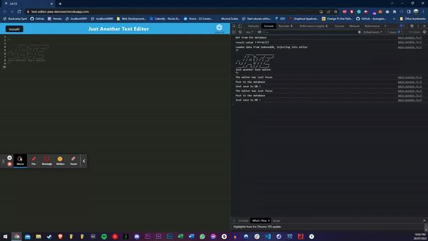

# text-editor-PWA


## Description
A simple single page Text Editor called JATE (Just Another Text Editor). It is an installable PWA. Stores persistent data in browser side indexedDB to allow for offline use. Built using a client server methodology. Technologies used are NodeJS, Express, Concurrently, Webpack, Babel.


## Table of Contents
1. [Installation](#installation)
2. [Usage](#usage)
3. [License](#license)
4. [Contributing](#contributing)
5. [Tests](#tests)
6. [Questions](#questions)

## Installation
- To install the application locally please follow the instructions below.
```bash
- git clone git@github.com:daman29/text-editor-PWA.git
- npm install
```
- Then run the server and build the client using
```bash
- npm run start
```


## Usage
- Run the application with the following command:
```bash
- npm run start
```
- Then visit [localhost:8080](localhost:8080) to use the app or [Click on this link](https://tech-blog-damneet.herokuapp.com/) to visit the live application on Heroku..

- Visit the application repository at [GitHub Repository](https://github.com/daman29/tech-blog)

The GIF below shows the basic functions of the application




## License
- This application is licensed under the [MIT License](./LICENSE)

## Contributing
- Clone repository first using git clone
- Contribute your changes to a new branch

## Tests
- No test commands

## Questions
- Reach me via email at damneet.sambhy@hotmail.com or issues on [github](https://github.com/daman29)